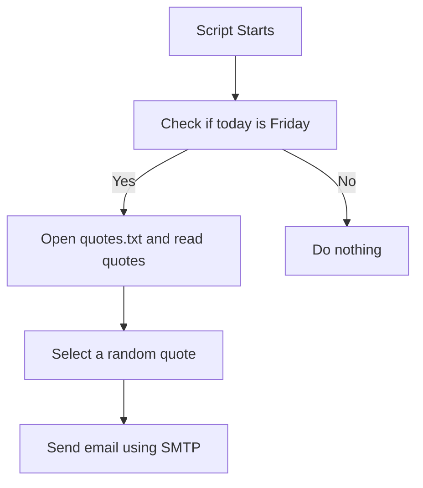
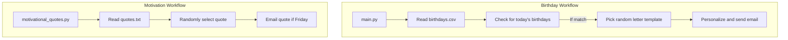

# Detailed Project Documentation: Birthday & Motivational Email Automation

This project automates two key tasks: **sending motivational quotes by email on a schedule** and **sending personalized birthday greetings**. The system uses Python scripts, data files, and email templates, and integrates with Gmail's SMTP for sending emails.

---

## motivational_quotes.py 📬

This script is responsible for sending a motivational quote to a specific email address every Friday. It utilizes a pool of quotes and sends one at random.

### Core Features

- **Automated Friday Check**: Only sends on Fridays (weekday index 4).
- **Random Quote Selection**: Picks a different quote each time.
- **Secure Email Sending**: Uses Gmail SMTP with TLS encryption.
- **Modular Functions**: Separates email sending logic and quote selection.

### Main Components

```python
import datetime as dt
import random
import smtplib

def send_email(message):
    email = "your-email-address"
    password = "your-app-password"
    with smtplib.SMTP("smtp.gmail.com", 587) as connection:
        connection.starttls()
        connection.login(user=email, password=password)
        connection.sendmail(
            from_addr=email,
            to_addrs="madhukiran.golla.personal@gmail.com",
            msg="Subject:Motivational Quote for the day\n\n" + message
        )

def send_quote():
    with open("quotes.txt", "r") as f:
        quotes = f.readlines()
    random_number = random.randint(1, len(quotes) - 1)
    quote_to_be_sent = quotes[random_number]
    send_email(quote_to_be_sent)

now = dt.datetime.now()
day_of_week = now.weekday()
print(day_of_week)
if day_of_week == 4:
    send_quote()
```

#### How It Works

- Loads all quotes from `quotes.txt`.
- Checks if today is Friday.
- Picks a random quote (excluding the first line).
- Sends it via email using Gmail's SMTP server.

#### Email Flow



---

## birthdays.csv

A CSV file storing the birthday data for each person who should receive a birthday email.

### Fields

| name  | email                               | year | month | day |
|-------|-------------------------------------|------|-------|-----|
| Madhu | madhukiran.golla.personal@gmail.com | 2025 | 12    | 5   |
| Kiran | madhukiran2k6@gmail.com             | 2025 | 12    | 6   |
| Golla | madhukiran2889@gmail.com            | 2025 | 12    | 6   |
| Madhu | madhuclicks.photos24@gmail.com      | 2025 | 12    | 6   |

#### Usage

- Used by `main.py` to check if today matches anyone's birthday.

---

## main.py 🎂

This script automates sending personalized birthday emails based on the birthday data in `birthdays.csv`.

### Core Features

- **Birthday Detection**: Checks if today matches any entry's day and month.
- **Random Template Use**: Selects from multiple birthday templates for variety.
- **Personalization**: Inserts each person's name into the message.
- **SMTP Integration**: Logs in and sends the email securely.
- **CSV Processing**: Efficiently reads and filters birthday records.

### Main Components

```python
import random, pandas
import datetime as dt
import smtplib

PLACEHOLDER = "[NAME]"

def send_email(birthday_person_data):
    email = "your-email-address"
    password = "your-app-password"
    name_of_person = birthday_person_data["name"]
    person_email = birthday_person_data["email"]
    with open(file=f"letter_templates/letter_{random.randint(1,3)}.txt", mode='r') as template:
        content = template.read()
    new_content = content.replace(PLACEHOLDER, name_of_person)
    with smtplib.SMTP('smtp.gmail.com', 587) as connection:
        connection.starttls()
        connection.login(email, password)
        connection.sendmail(
            from_addr=email,
            to_addrs=person_email,
            msg="Subject:Happy Birthday to You\n\n" + new_content
        )

today = dt.datetime.now()
date = today.day
month = today.month
birthday_file = pandas.read_csv('birthdays.csv')
date_of_all = birthday_file["day"].to_list()
month_of_all = birthday_file["month"].to_list()

for i in range(len(date_of_all)):
    if date_of_all[i] == date and month_of_all[i] == month:
        info = birthday_file[birthday_file["day"] == date_of_all[i]]
        for index, row in info.iterrows():
            send_email(row)
        break
```

#### How It Works

- Reads today’s date.
- Loads all birthdays from the CSV.
- Compares each entry’s day/month to today.
- If matches, selects a random letter template.
- Replaces `[NAME]` in template with recipient’s name.
- Sends the email.

#### Birthday Email Sending Flow

```mermaid
flowchart TD
    A[Script Starts] --> B[Get today's date]
    B --> C[Read birthdays.csv]
    C --> D[Check if any entry matches today]
    D -- Yes --> E[Select random template]
    E --> F[Replace [NAME] with person's name]
    F --> G[Send email via SMTP]
    D -- No --> H[End script]
```

---

## send_mail.py

This script demonstrates how to send a simple informational email via SMTP.

### Core Features

- **Credential Use**: Uses Gmail SMTP credentials.
- **Fixed Email Content**: Sends a predefined message.
- **Reusability**: Serves as a reference or quick test for email sending.

### Main Components

```python
import smtplib

email = "your-email-address"
password = "your-app-password"
with smtplib.SMTP('smtp.gmail.com', 587) as connection:
    connection.starttls()
    connection.login(email, password)
    connection.sendmail(
        from_addr="lytblenders@gmail.com",
        to_addrs="madhukiran.golla.personal@gmail.com",
        msg="Subject: Information regarding your new Internship\n\n"
            "Hope this email finds you! Congrats on your first Internship"
    )
```

#### How It Works

- Connects to Gmail's SMTP server.
- Logs in with credentials.
- Sends a static congratulatory email.

---

## time_module.py

This script illustrates the use of Python's datetime module to fetch and display the current date, and to construct a specific datetime object for a birthday.

### Core Features

- **Current Date Extraction**: Prints the current year, month, and day.
- **Datetime Creation**: Creates a datetime object for a specific birthday.

### Main Components

```python
import datetime as dt
now = dt.datetime.now()
year = now.year
month = now.month
day = now.day
print(year, month, day)

birthday_time = dt.datetime(year, month=12, day=5)
print(birthday_time)
```

#### How It Works

- Prints today’s year, month, and day.
- Prints a datetime object for December 5 of the current year.

---

## quotes.txt

A text file containing a large collection of motivational quotes, one per line. Each quote is structured as a string, sometimes attributed to an author.

#### Usage

- The system reads this file and selects a random line to send as an email (see `motivational_quotes.py`).

---

## letter_1.txt, letter_2.txt, letter_3.txt

These are **birthday email templates**. Each uses `[NAME]` as a placeholder, which is replaced by the actual recipient's name for personalization.

### Sample Contents

- **letter_1.txt**
    ```
    Dear [NAME], Happy birthday! All the best for the year! Madhu
    ```

- **letter_2.txt**
    ```
    Hey [NAME], Happy birthday! Have a wonderful time today and eat lots of cake! Lots of love, Madhu
    ```

- **letter_3.txt**
    ```
    Dear [NAME], It's your birthday! Have a great day! All my love, Madhu
    ```

#### Usage

- `main.py` randomly selects one of these when sending a birthday email, replacing `[NAME]` as appropriate.

---

## Security, Usage & Best Practices

```card
{
    "title": "Secure Your Credentials",
    "content": "Always keep your real email and app password secret. Use environment variables or a configuration file not committed to version control."
}
```

- **Never hardcode sensitive credentials in shared code.**
- **Gmail's 'app password' is required if 2FA is enabled.**
- Use a scheduler (like cron or Windows Task Scheduler) to automate running the scripts regularly.

---

## Common Data Flow



---

## Extending Functionality

- **Add More Templates**: Increase the variety of birthday messages.
- **Support Multiple Recipients**: Modify scripts for mass motivational mailings.
- **Logging**: Add logging for sent emails and errors.
- **Web Interface**: Create a simple front-end to add birthdays or quotes.

---

## Troubleshooting

```card
{
    "title": "Possible Issues",
    "content": "Check internet connectivity and Gmail SMTP settings if emails are not sent. Ensure less secure app access is allowed or use app passwords."
}
```

---

## Summary Table

| File Name              | Purpose                               | Dependencies                                     |
|------------------------|---------------------------------------|--------------------------------------------------|
| motivational_quotes.py | Sends motivational quote every Friday | quotes.txt, smtplib                              |
| main.py                | Sends personalized birthday emails    | birthdays.csv, letter_1/2/3.txt, smtplib, pandas |
| send_mail.py           | Demo for sending a fixed email        | smtplib                                          |
| time_module.py         | Demonstrates datetime usage           | datetime                                         |
| birthdays.csv          | List of people and their birthdays    | pandas (read)                                    |
| quotes.txt             | List of motivational quotes           | motivational_quotes.py                           |
| letter_1/2/3.txt       | Birthday email templates              | main.py                                          |

---

# Conclusion

This project offers a robust, extensible base for automating the sending of both motivational and birthday emails. It makes use of Python's capabilities for file I/O, date handling, and SMTP, and demonstrates best practices for modularity and template use. With proper scheduling and environment isolation, it can serve personal, familial, or even small team needs for automated, personalized communications.